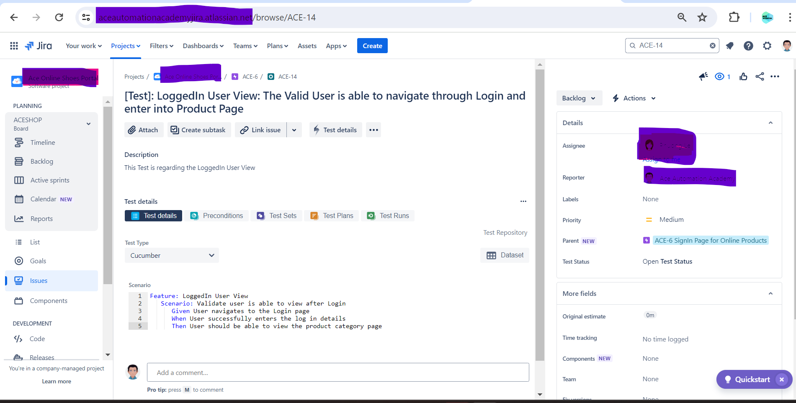
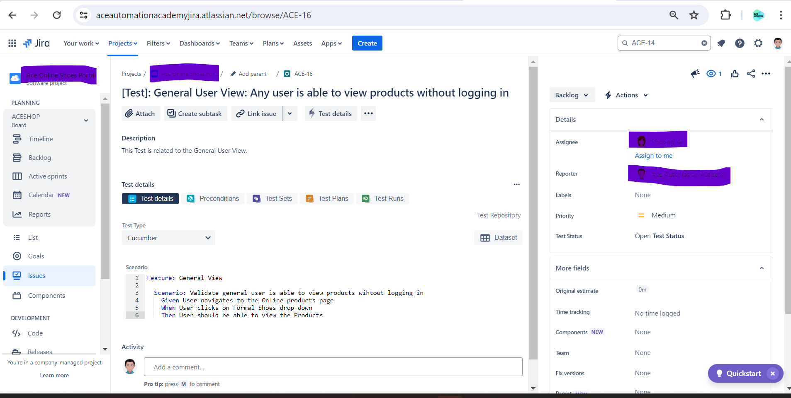
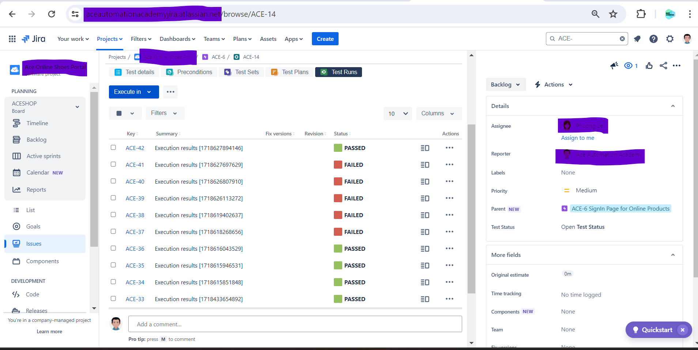
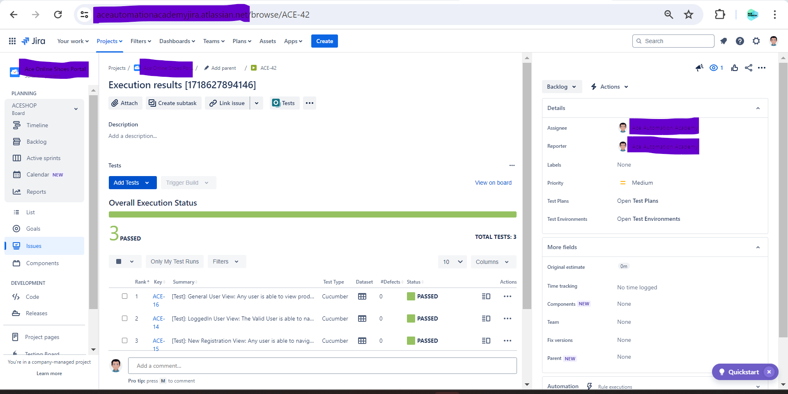

<h1 align="center"> Cucumber BDD framework with web driver manager & integration with Xray Test Management tool </h1>  

  <b>Description:</b> This is a demo project on how to setup a <b style="background-color:lightyellow;">BDD Cucumber framework</b> with <b style="background-color:lightyellow;">Selenium-4</b> in a <b style="background-color:lightyellow;">Page Object Model Concept</b> for better reusability, maintainability and scalability. Here we are using the <b style="background-color:lightyellow;">Web driver manager</b> library which will take care of the version of the driver - and automatically matches with the google chrome version - and we need not donwload and install the web driver. This framework also integrates with <b style="background-color:lightgreen;">Xray Test Management tool</b>. The features contain the <b style="background-color:lightgreen;">annotations</b> which call the issue ids present in the Xray in order to create the <b style="background-color:lightgreen;">Test Execution Issue</b> 
. Please note that this framework also uses <b style="background-color:lightblue;">docker</b> and this would help in <b style="background-color:lightblue;">CICD framework</b> - where these tests can be invoked with a single command and test results would automatically be created as part of the Test Run by <b style="background-color:lightblue;">importing results into the Xray </b>

## Table of Contents

- [Introduction](#introduction)
- [Features](#features)
- [Requirements](#requirements)
- [Quick Start](#quick-start)

## Introduction

## Manual Verification: 
### there are 3 testcases which we want to automate:

#### 1. LoggedIn User View: 
   When a user has a valid login details and he tries to navigate after he has successfully logged in

#### 2. New Registration View:
When a user is not a valid login and wants to register himself and navigates to Registration Page

#### 3. General User View:
When a user doesnot a login page neither he wants to register himself but he wants to navigate and have a look at the Online Products page

## Features
### 1. LoggedIn.feature
<b>Scenario</b>: Validate user is able to view after Login
<b>Given</b> User navigates to the Login page
<b>When</b> User successfully enters the log in details
<b>Then</b> User should be able to view the product category page

### 2. NewUserRegistration.feature
<b>Scenario:</b> Validate new user is able to view after clicking on new Registration
<b>Given</b> User navigates to the Login page
<b>When</b> User clicks on new Registration button
<b>Then</b> User should be able to view the Registration page

### 3. GeneralUserView.feature
<b>Scenario:</b> Validate general user is able to view products wihtout logging in
<b>Given</b> User navigates to the Online products page
<b>When</b> User clicks on Formal Shoes drop down
<b>Then</b> User should be able to view the Products

## Test Requirements
The tests are validated by navigation 

### Local
* [Java 11 SDK](https://www.oracle.com/au/java/technologies/javase/jdk11-archive-downloads.html)
* [Maven](https://maven.apache.org/download.cgi)
* [ChromeDriver](https://chromedriver.chromium.org/downloads)

## Test Automation Verification:

### Xray Reporting and reflection of the results

 1. The below is the representation of the Test Issue Type - this is for LoggedIn feature in the type of cucumber tests in Xray Management

2. the below is for the New User Registration

3. the below is for the General User View

4.Each time the Execution is performed in docker with command as 'docker-compose up' a new execution is created.
the below test runs sections

5. If head over to the Test Execution Item - the report status appears there:
if you check on ACE-42 for e.g:
